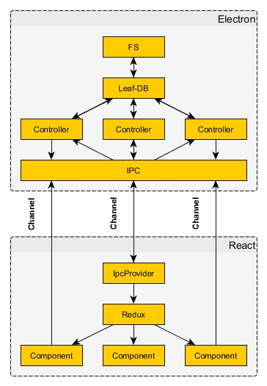

# Doombox - IPC

## Global data flow



## Channels

- `WINDOW` - Window actions (minimize, maximize, etc.)
- `LIBRARY` - Library controller
- `IMAGE` - Image controller
- `ALBUM` - Album controller
- `LABEL` - Label controller
- `THEME` - Storage controller (theme)
- `CACHE` - Storage controller (cache)
- `CONFIG` - Storage controller (config)
- `KEYBIND` - Keybind actions (play, pause, etc.)
- `INTERRUPT` - Interrupt data channel
- `VIEW` - Routing (interrupt, main, etc.)

## Protocol

Electron expects a specific payload structure:

**Payload**

```JSON
{
  action: <String>, // IPC.ACTION
  route: { // Optional
    from: <String>, // VIEW, set client route to `from` on arrival
    to: <String> // VIEW, set client route to `to` on success
  },
  data: <Object> // Data, depends on action
}
```

**Action: INSERT**

```JSON
{
  data: <String> || Array<String>
}
```

**Action: FIND**

```JSON
{
  data: {
    query: <String>,
    projection: Array<String>
  }
}
```

**Action: UPDATE**

```JSON
{
  data: {
    query: <String>,
    update: <Object>,
    projection: Array<String>
  }
}
```
